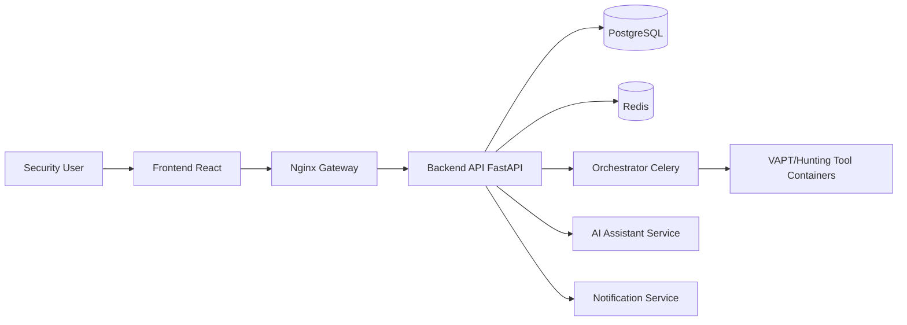

# Expl0V1N Framework


[](https://docker.com)
[](LICENSE)
[](#)

Enterprise defensive security platform for single-target VAPT and advanced bug hunting workflows.

## Feature Highlights

- Single-target VAPT workflow (IP/domain/URL), safe-by-default (no auto exploitation)
- Bug Hunting mode with recon-to-report pipeline and 15 advanced fast methods
- Queue-based orchestration with CPU/RAM admission control and step checkpoints
- Role-based auth (admin/user), audit logs, approvals for external targets
- PDF/JSON reporting, trend/delta views, Telegram alerts, AI security assistant

## Architecture Diagram



## Quick Start (3 Commands)

```bash
git clone https://github.com/your-org/expl0v1n-framework.git
cd expl0v1n-framework && cp .env.example .env
docker compose --profile core up -d --build
```

UI (via gateway): http://localhost
API (via gateway): http://localhost/api/v1
API (direct): http://127.0.0.1:8000/api/v1

## Screenshots

- Dashboard: docs/assets/screenshots/dashboard.png
- VAPT Workflow: docs/assets/screenshots/vapt.png
- Bug Hunting: docs/assets/screenshots/hunting.png
- AI Assistant: docs/assets/screenshots/ai-chat.png

## Tech Stack

| Layer | Technology |
|---|---|
| Frontend | React 18, TypeScript, Vite |
| API | FastAPI, SQLAlchemy, JWT |
| Queue | Redis + Celery |
| Database | PostgreSQL 16 |
| Orchestration | Docker Compose profiles |
| Reporting | JSON + PDF artifacts |
| AI | OpenAI/Ollama-compatible proxy service |

## Documentation

- Installation: docs/INSTALLATION.md
- Usage: docs/USAGE.md
- API: docs/API.md
- Architecture: docs/ARCHITECTURE.md
- Tool Integration: docs/TOOLS.md
- Production Checklist: docs/PRODUCTION_CHECKLIST.md
- Contributing: docs/CONTRIBUTING.md

## Wiki

- Home: wiki/Home.md
- Platform Overview: wiki/Platform-Overview.md
- Deployment Guide: wiki/Deployment-Guide.md
- VAPT Mode: wiki/VAPT-Mode.md
- Bug Hunting Mode: wiki/Bug-Hunting-Mode.md
- Advanced Methods: wiki/Advanced-Methods.md
- AI Assistant: wiki/AI-Assistant.md
- Security Model: wiki/Security-Model.md
- Operations Runbook: wiki/Operations-Runbook.md
- Troubleshooting: wiki/Troubleshooting.md
- API Cookbook: wiki/API-Cookbook.md

## Contributing

See docs/CONTRIBUTING.md.

## License

MIT (see LICENSE).