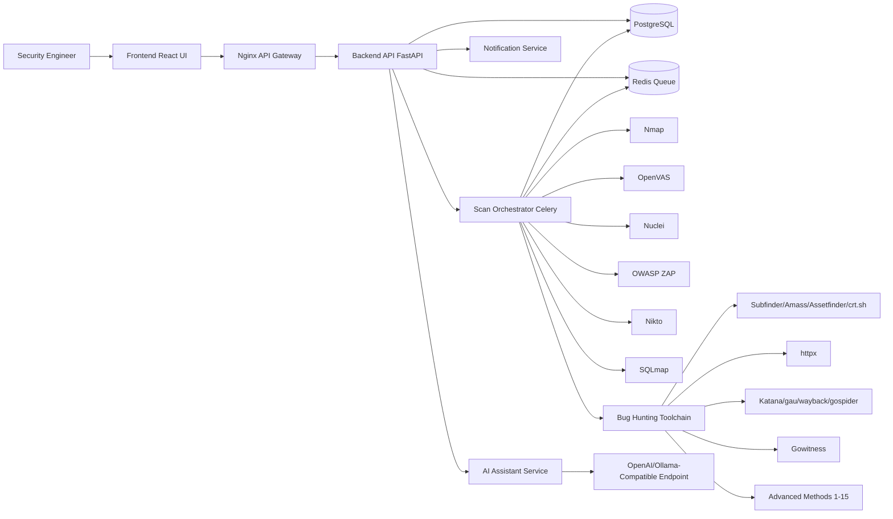
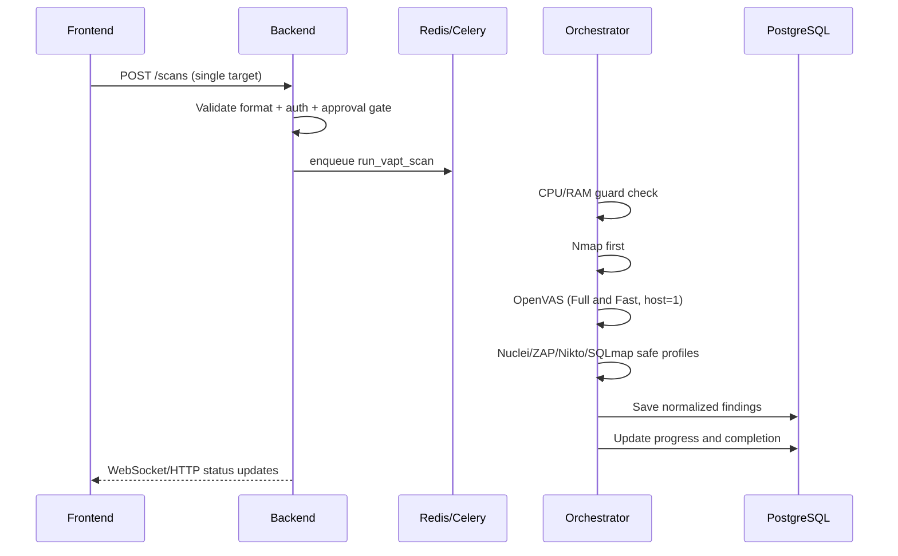
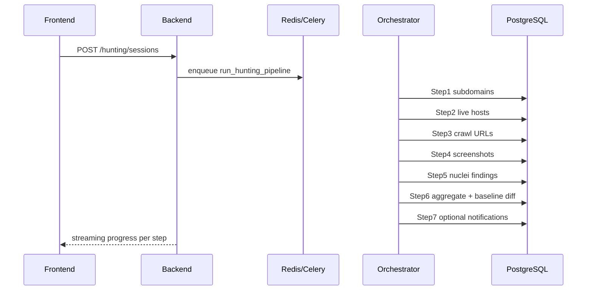
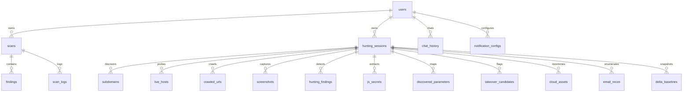

# Expl0V1N Architecture

## 1) System Architecture (VAPT + Bug Hunting + Advanced + AI)

## 2) Service Responsibility Breakdown (35 Services)

| # | Service | Responsibility |
|---|---|---|
| 1 | frontend | Web UI, auth UX, dashboard, scan forms, AI chat widget |
| 2 | backend | REST API, RBAC, validation, audit logging, report APIs |
| 3 | orchestrator | Queue workers, execution sequencing, normalization |
| 4 | redis | Celery broker/result backend, event bus |
| 5 | postgres | Persistent state for all scans/findings/history |
| 6 | openvas | Safe network vuln scanning with strict host/concurrency limits |
| 7 | nmap | Port/service discovery and seed data for other tools |
| 8 | nuclei | Template-based scanning (VAPT + Hunting) |
| 9 | zap | Headless web/API scanner |
| 10 | nikto | Web server misconfiguration discovery |
| 11 | sqlmap | Controlled SQL injection checks |
| 12 | metasploit | CVE/exploit matching only, no auto exploit |
| 13 | subfinder | Passive subdomain enumeration |
| 14 | amass | Passive ASN/subdomain intel enrichment |
| 15 | httpx | Live host probing + metadata |
| 16 | katana | URL/endpoint crawling |
| 17 | nuclei (shared) | Bug hunting template execution |
| 18 | gowitness | Screenshot capture and gallery artifacts |
| 19 | notification-service | Telegram alerts (extensible to webhooks) |
| 20 | ai-assistant | Context-aware LLM proxy, policy and rate limit |
| 21 | massdns | High-throughput DNS resolution |
| 22 | puredns | Wildcard filtering + resolver validation |
| 23 | altdns-dnsgen | Subdomain permutations/mutations |
| 24 | masscan | High-speed SYN scan for CIDR inventory |
| 25 | ffuf | Fast web/API content fuzzing |
| 26 | feroxbuster | Recursive content discovery |
| 27 | kiterunner | API route brute force/discovery |
| 28 | arjun | Hidden parameter discovery |
| 29 | trufflehog | Secret scanning in JS/content artifacts |
| 30 | linkfinder/jsluice | JS endpoint and token extraction |
| 31 | subjack | Subdomain takeover checks |
| 32 | cloud-enum | Cloud asset exposure discovery |
| 33 | interactsh | OOB callback infrastructure for SSRF validation |
| 34 | theharvester | Email/account reconnaissance |
| 35 | asnmap+mapcidr | ASN->CIDR expansion and infra correlation |

## 3) VAPT Data Flow

## 4) Bug Hunting Data Flow

## 5) Database ER Diagram

## 6) Queue and Task Flow

- Queue names: `vapt`, `hunting`, `default`
- Worker strategy:
  - `vapt`: serial by policy (one scan target at a time)
  - `hunting`: one pipeline active by default
  - `default`: notifications, maintenance, feed updates
- Retries: exponential backoff with task-level idempotency keys
- Resume: pipeline step checkpoints in `hunting_sessions.current_step`

## 7) Network Topology

- `frontend-net`: internet-facing UI and reverse proxy traffic.
- `backend-net`: internal API/data plane, not internet exposed.
- `scan-net`: scanner containers and orchestrator execution network.
- Policy: tools do not directly access frontend network.

## 8) Security Model

- Mandatory JWT auth for all scanning endpoints.
- RBAC roles: `admin`, `user`.
- External target approval workflow required before execution.
- Scope allowlisting for root domains/CIDRs.
- Safe defaults: no auto exploitation, conservative rates/timeouts.
- Full audit logs on create/update/delete/start/cancel actions.
- API rate limiting at Nginx and application middleware.
